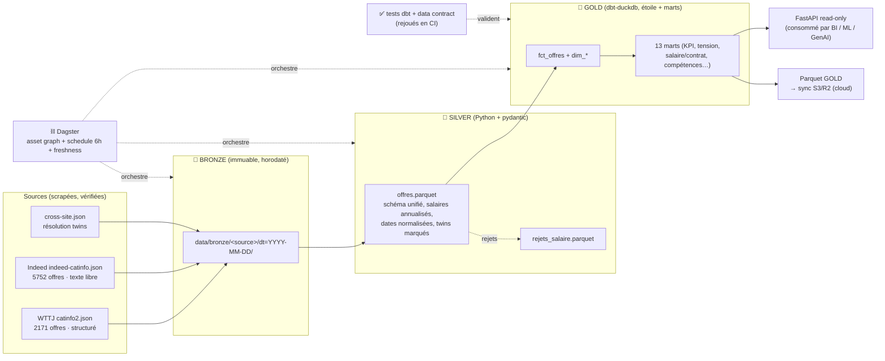

# Observatoire Data/IA IDF — Lakehouse ELT orchestré & DataOps (Module 01)

> **Le SOCLE de la plateforme [CartoData IDF](../README.md).** J'ai industrialisé mes propres scrapers d'offres Data/IA d'Île-de-France en un **lakehouse ELT medallion** — orchestré (Dagster), transformé et testé (dbt), conteneurisé (Docker), exposé en API (FastAPI) et *cloud-ready* (sync objet S3-compatible) — qui produit le **dataset GOLD** consommé par tous les autres modules du portfolio.

Le vrai métier d'un data engineer junior n'est pas un modèle ML : c'est **faire couler une donnée sale, multi-source, de façon fiable, répétable et observable**. Ce projet prouve exactement ça, sur des données **réelles** (pas un CSV Kaggle propre) : 2 schémas sources incompatibles, des salaires en texte libre, des dates relatives, des champs partiels — tous **mesurés et assumés en clair**.

---

## 🏛️ Architecture (medallion bronze → silver → gold)



**Un seul flux, plusieurs consommateurs.** Le mart GOLD est la colonne vertébrale : le module BI le lit pour son dashboard, le module Gouvernance pose son contrat dessus, le module ML l'utilise comme matrice de features.

---

## 🧰 Stack

| Couche | Outils |
|---|---|
| Ingestion / transformations Python | **Python 3.11**, **pydantic** (validation de schéma), pandas, pyarrow |
| Entrepôt | **DuckDB** (embarqué, lit/écrit Parquet, zéro serveur — choix dimensionné assumé, pas Spark) |
| Transformations GOLD | **dbt-duckdb** (staging → étoile → marts, tests, docs/lineage) |
| Orchestration | **Dagster** (asset graph bronze→silver→gold, schedule 6h, retries, metadata) |
| API | **FastAPI** (lecture seule sur le GOLD) |
| Cloud | **boto3** → bucket objet S3-compatible (Cloudflare R2 / S3 free-tier) |
| Qualité / CI | **pytest**, **ruff**, **GitHub Actions** |
| Conteneurisation | **Docker** + docker-compose |

---

## 📁 Arborescence

```
01-data-engineering/
├── src/cartodata_de/
│   ├── parsing/         salary.py · dates.py · geo.py · skills.py   (fonctions pures testées)
│   ├── sources/         wttj.py · indeed.py · labels.py · housing.py(stub)
│   ├── schemas.py       schéma SILVER unifié (pydantic)
│   ├── dedup.py         réconciliation cross-source (Jaccard ≥0.6 / 0.85)
│   ├── bronze.py        ingestion immuable horodatée
│   ├── pipeline.py      orchestrateur ELT (entrypoint) bronze→silver→gold
│   ├── warehouse.py     accès lecture DuckDB
│   └── api.py           API FastAPI GOLD
├── dbt/                 projet dbt-duckdb (models/staging · intermediate · marts ; tests)
├── orchestration/       definitions.py (assets Dagster) + workspace.yaml
├── tests/               pytest (parsing, dedup, comptages de référence) + fixtures/ (échantillon)
├── contracts/           gold_offre.yml (data contract)
├── scripts/             make_fixtures.py · sync_cloud.py
├── Dockerfile · docker-compose.yml · .github/workflows/ci.yml
├── ENGINEERING_NOTES.md · RECAP.md · README.md
```

---

## 🚀 Démarrage

```powershell
# 1. Installer
py -m pip install -r requirements.txt
py -m pip install -e .

# 2. Pipeline complet : bronze → silver → dbt build (+ tests) → export GOLD
py -m cartodata_de.pipeline                 # dataset complet (si présent)
py -m cartodata_de.pipeline --ci            # mode échantillon (exclut les tests 'fullonly')

# 3. dbt seul (docs + lineage)
dbt build --project-dir dbt --profiles-dir dbt
dbt docs generate --project-dir dbt --profiles-dir dbt && dbt docs serve --project-dir dbt

# 4. Orchestrateur (UI lineage + schedule)
dagster dev -f orchestration/definitions.py            # http://localhost:3000

# 5. API GOLD
uvicorn cartodata_de.api:app --reload                  # http://localhost:8000/docs

# 6. Qualité
py -m ruff check . ; py -m pytest

# Tout-en-un (conteneurs)
docker compose up
```

> Sources : par défaut le pipeline lit les fichiers réels s'ils sont présents (variables `WTTJ_SRC` / `INDEED_SRC` / `CROSS_SRC`), sinon il retombe sur l'**échantillon commité** (`tests/fixtures/`) pour qu'un clone tourne immédiatement.

---

## 📊 Chiffres clés (dataset complet)

- **7 643 offres** retenues = WTTJ **2 164** (status 200) + Indeed **5 479** − **273 twins** dédupliqués.
- **2 290 entreprises**, **364 communes**, **86,5 %** des offres en IDF identifié.
- **Salaire médian annualisé : 49 000 €** (Q1 29 664 · Q3 65 000). Médianes/contrat : Freelance **109 k** · CDI **52,5 k** · Stage **15 k**.
- **152** chaînes de salaire Indeed non parsables → **tracées** (table de rejet), pas masquées.
- Top compétences : Machine Learning **586** · Python **297** · LLM **116** · Power BI **81** · SQL **71**.
- **Qualité : 56 tests dbt + 44 tests pytest, 100 % verts.**

### Complétude réelle (assumée en clair — `mart_completude`)
| Champ | Complétude |
|---|---|
| Ville | 99,9 % |
| Métier / Télétravail / Date précise | 28,3 % |
| Salaire | **24,1 %** |
| Expérience | **11,6 %** |
| Diplôme | **9,1 %** |

Ces trous sont **réels et vérifiés sur disque** — c'est la matière première du projet, pas une faiblesse à cacher.

---

## ✅ Qualité & data contract

- **Tests dbt** : `not_null`, `unique`, `accepted_values`, `relationships` (faits ↔ dimensions).
- **Test « data contract » figé** (`tests/assert_reference_counts.sql`, tag `fullonly`) : tout agrégat doit retomber sur les comptages re-vérifiés sur disque (WTTJ 2171 · status 200 = 2164 · CDI 1417 · Paris 1216 · Indeed 5752 · salPer 789 · **0 doublon d'URL**). Si une transformation casse un total, **la CI passe au rouge**.
- **`contracts/gold_offre.yml`** : schéma, enums, nullabilité, SLA de fraîcheur (6h), garanties qualité et limites connues.
- **CI** (`.github/workflows/ci.yml`) : ruff + pytest + pipeline sur échantillon + `dbt build` + génération de la doc dbt à chaque push.

---

## ☁️ Cloud-ready (honnête)

Tout tourne en local (DuckDB/Docker). La couche GOLD (Parquet) est **synchronisable vers un bucket objet S3-compatible** (`scripts/sync_cloud.py`, activé si credentials présents) : l'artefact consommé par les autres modules est aussi dans le cloud. Pas de cluster managé — *« savoir ne pas sur-dimensionner est une compétence »*.

---

## ⚠️ Limites assumées (cf. `ENGINEERING_NOTES.md`)

- Dates Indeed **relatives** → exclues de l'axe temporel (`dim_date` = WTTJ uniquement).
- Indeed n'expose pas le contrat de façon fiable → `Non précisé`.
- Géocodage lat/lon (API BAN) **non fait** → granularité = département (backlog).
- Greffe territoire (DVF/DPE/BAN) **stubée** (`housing_bronze`) : prouve la généricité de l'archi sans diluer le cœur emploi.
- Le **scraping** reste hors CI (tâche planifiée locale) ; la CI rejoue le **build**, pas la collecte.

---

*Données = offres d'emploi publiques (marché concurrentiel IDF). Aucune donnée personnelle. Dépôt public-safe.*
